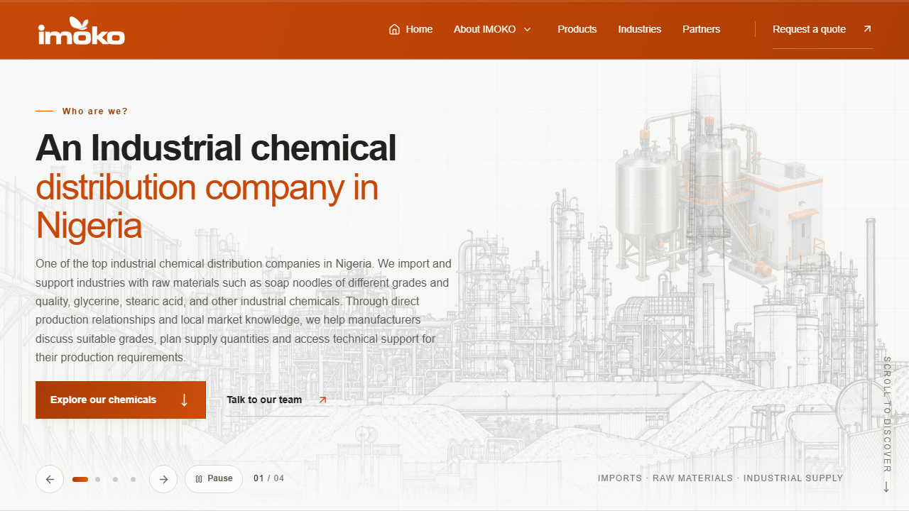
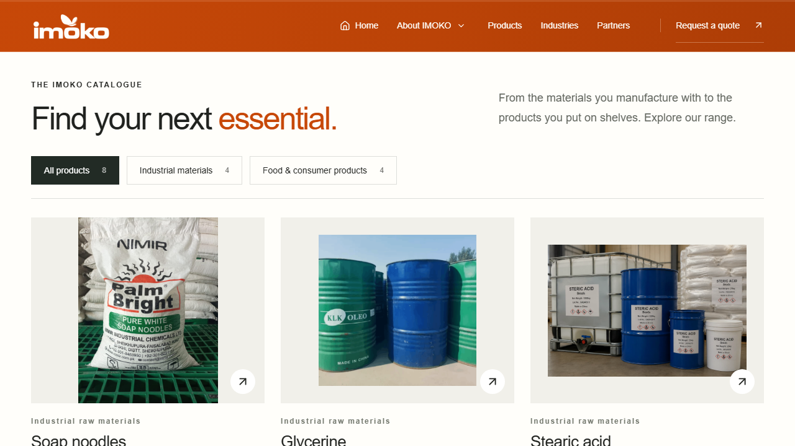

# IMOKO website case study

A corporate catalogue website for industrial materials and food products in the Nigerian market. The repository records the implementation and design iterations maintained in this account with AI-assisted development.

## Implemented scope

- Responsive catalogue with eight product pages, division filters, variants and brochure downloads.
- Leadership profiles, company information and contact pages.
- An enquiry flow that carries product selections into a local text download. It does not submit orders, send mail or store customer records.
- A static production build and separate Next.js server preview.

## Engineering choices

The production app exports static files for conventional hosting. Product data and assets are checked in, so browsing needs no API/database. The preview has separate hosting configuration and must be checked independently; it can differ from production. Shared browser tests exercise user journeys on both builds.

The project demonstrates frontend implementation, content modelling, static hosting and quality checks. Company brand/product assets remain the property of their owners. No sales, availability, performance or commercial outcome is claimed from source alone.

## Evidence and reproduction

Build and run the checks in [VALIDATION.md](VALIDATION.md). These screenshots are captures of the local production build, not proof of a currently available public deployment.

Production URL recorded by the app: https://imokong.com. Verify availability independently before sharing it as a current live demonstration.

See [development history](DEVELOPMENT-HISTORY.md) for earlier artwork and component iterations.
